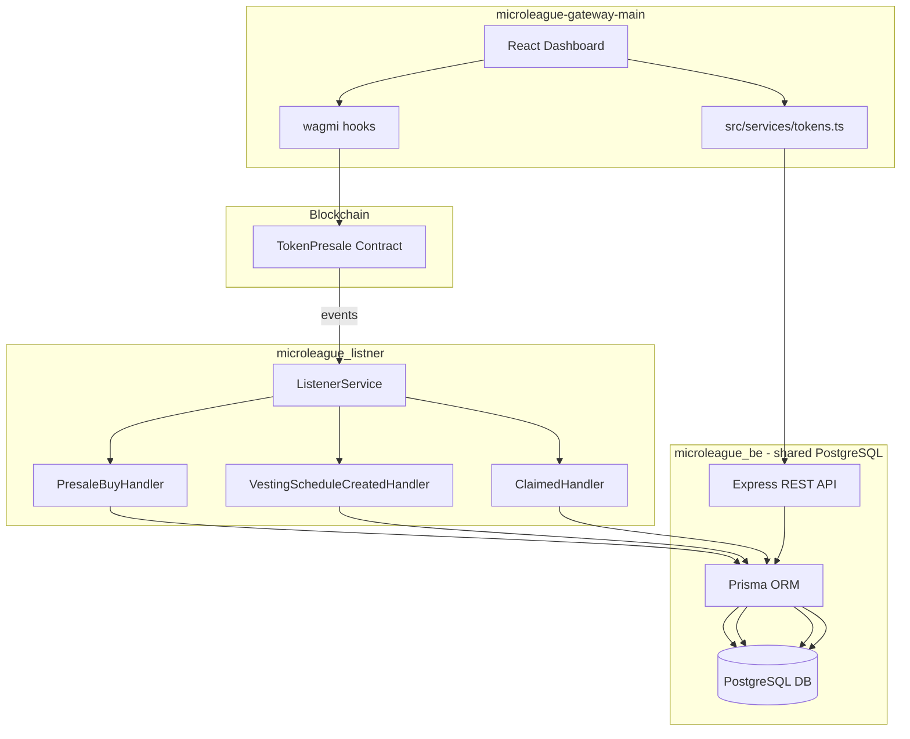

# Design Document: Dashboard Tokens & Vesting

## Overview

This feature adds fully functional "My Tokens" and "Vesting" tabs to the MicroLeague dashboard. Both tabs surface on-chain presale data to the connected user.

The implementation spans three services:

- `microleague_listner` — indexes `VestingScheduleCreated` and `Claimed` blockchain events, writing records to the shared `microleague_be` PostgreSQL database.
- `microleague_be` — owns all REST API endpoints for token and vesting data. New Prisma models (`PresaleUser`, `PresaleTx`, `VestingSchedule`, `ListenerState`, `FailedEvent`) are added to its schema so both services share one database.
- `microleague-gateway-main` — React/TypeScript/Vite frontend. Reads live token data directly from the presale contract via wagmi, fetches historical/off-chain data from `microleague_be` APIs, and executes the `claim()` transaction via wagmi `writeContract`.

The frontend never calls the listener directly.

---

## Architecture



**Key architectural decisions:**

- The listener connects to the `microleague_be` database via `DATABASE_URL` — it does not have its own separate database.
- `microleague_be` owns the Prisma schema for all presale models. The listener's `prisma/schema.prisma` is kept only for its own internal models (Admin, BankTransfer) or removed entirely once migration is complete.
- Live token amounts (totalAllocated, totalClaimed, claimableAmount, vesting schedules) are read directly from the contract via wagmi — the backend serves historical/aggregate data only.
- The `claim()` transaction is submitted directly from the frontend via wagmi `writeContract`.

---

## Components and Interfaces

### microleague_be — New REST Endpoints

All new routes are added to `microleague_be/src/router.ts` and are unauthenticated (public).

```
GET /user/wallet/:walletAddress
  → PresaleUserDto

GET /transactions/address/:walletAddress?type=Buy&page=1&limit=10
  → TransactionPageDto

GET /vesting/:walletAddress
  → VestingScheduleDto[]

GET /vesting/:walletAddress/summary
  → VestingSummaryDto
```

**PresaleUserDto**
```typescript
{
  walletAddress: string;       // lowercase
  tokensPurchased: number;
  claimed: number;
  unclaimed: number;
  amountSpent: number;
  joinDate: string | null;     // ISO 8601
  lastActivity: string | null; // ISO 8601
}
```

**TransactionPageDto**
```typescript
{
  data: PresaleTxDto[];
  total: number;
  page: number;
  limit: number;
  totalPages: number;
}

// PresaleTxDto
{
  txHash: string;
  contract: string;
  address: string;
  tokenAddress: string;
  type: string;          // "Buy" | "Claim" | ...
  amount: number;
  stage: number;
  tokens: number;
  timestamp: number;     // unix seconds
  usdAmount: number;
  quote: string;         // payment token address
}
```

**VestingScheduleDto**
```typescript
{
  id: string;
  walletAddress: string;
  scheduleId: number;
  totalAmount: number;
  startTime: number;     // unix seconds
  cliff: number;         // seconds
  duration: number;      // seconds
  releaseInterval: number;
  claimed: number;
  contract: string;
}
```

**VestingSummaryDto**
```typescript
{
  totalAllocated: number;
  totalClaimed: number;
  totalUnclaimed: number;
  scheduleCount: number;
}
```

### microleague_be — New Controllers and Services

```
src/controllers/presaleUser.ts   — GET /user/wallet/:walletAddress
src/controllers/transactions.ts  — GET /transactions/address/:walletAddress
src/controllers/vesting.ts       — GET /vesting/:walletAddress, GET /vesting/:walletAddress/summary
src/services/presaleUserService.ts
src/services/transactionsService.ts
src/services/vestingService.ts
```

### microleague_listner — New Handler

```
src/modules/listener/handlers/vesting-schedule-created.handler.ts
src/modules/listener/handlers/claimed.handler.ts
```

Both handlers are registered in `listener.module.ts` and `handler-registry.service.ts`. They use the shared `DATABASE_URL` pointing to the `microleague_be` PostgreSQL instance.

### microleague-gateway-main — New Frontend Modules

```
src/services/tokens.ts                          — API service module
src/components/dashboard/MyTokensTab.tsx        — My Tokens tab component
src/components/dashboard/VestingTab.tsx         — Vesting tab component
src/components/dashboard/VestingClaimModal.tsx  — Claim confirmation modal
```

**tokens.ts exports:**
```typescript
getTokenSummary(walletAddress: string): Promise<TokenSummary>
getTokenTransactions(walletAddress: string, page: number, limit: number): Promise<TransactionPage>
getVestingSchedules(walletAddress: string): Promise<VestingScheduleRecord[]>
getVestingSummary(walletAddress: string): Promise<VestingSummary>
```

**Wagmi contract reads used in VestingTab / MyTokensTab:**
```typescript
// Already in UserDashboard — reused:
totalAllocated(address)       → bigint
totalClaimed(address)         → bigint
claimableAmount(address)      → bigint

// New reads in VestingTab:
getVestingSchedulesCount(address)          → bigint
getVestingSchedule(address, index)         → [totalAmount, claimed, vested, claimable, startTime, cliff, duration, releaseInterval]
claimEnabled()                             → boolean
```

**Wagmi contract write used in VestingTab:**
```typescript
claim()   // no args — claims all claimable across all schedules
```

The presale ABI is already in `src/contracts/tokenPresaleAbi.ts`. The relevant function signatures are extracted from `microleague_listner/src/modules/listener/abis/presaleAbi.ts` — no duplication needed.

---

## Data Models

### New models added to `microleague_be/prisma/schema.prisma`

```prisma
enum PresaleTxType {
  Blockchain
  Wert
  Crypto_Payment
  Bank_Transfer
  Other_Cryptos
  Card_Payment
  Buy
  Claim
}

model PresaleUser {
  id               String    @id @default(cuid())
  walletAddress    String    @unique
  tokensPurchased  Float     @default(0)
  claimed          Float     @default(0)
  unclaimed        Float     @default(0)
  amountSpent      Float     @default(0)
  joinDate         DateTime?
  lastActivity     DateTime?

  presaleTxs       PresaleTx[]
  vestingSchedules VestingSchedule[]

  createdAt        DateTime  @default(now())
  updatedAt        DateTime  @updatedAt

  @@map("presale_users")
}

model PresaleTx {
  id            String        @id @default(cuid())
  txHash        String        @unique
  contract      String
  address       String
  tokenAddress  String
  type          PresaleTxType @default(Crypto_Payment)
  amount        Float
  stage         Int
  tokens        Float
  timestamp     Int
  usdAmount     Float
  quote         String

  presaleUser   PresaleUser?  @relation(fields: [address], references: [walletAddress])

  createdAt     DateTime      @default(now())
  updatedAt     DateTime      @updatedAt

  @@index([address])
  @@index([type])
  @@map("presale_txs")
}

model VestingSchedule {
  id              String      @id @default(cuid())
  walletAddress   String
  scheduleId      Int
  totalAmount     Float
  startTime       Int         // unix seconds
  cliff           Int         // seconds
  duration        Int         // seconds
  releaseInterval Int
  claimed         Float       @default(0)
  contract        String

  presaleUser     PresaleUser @relation(fields: [walletAddress], references: [walletAddress])

  createdAt       DateTime    @default(now())
  updatedAt       DateTime    @updatedAt

  @@unique([walletAddress, scheduleId, contract])
  @@index([walletAddress])
  @@map("vesting_schedules")
}

model ListenerState {
  id            String    @id @default(cuid())
  contract      String
  blockNumber   Int
  hash          String
  logIndex      Int
  processedAt   DateTime
  eventId       String    @unique
  type          String
  eventName     String
  blockHash     String
  reorged       Boolean   @default(false)
  reorgedAt     DateTime?

  createdAt     DateTime  @default(now())
  updatedAt     DateTime  @updatedAt

  @@map("listener_state")
}

model FailedEvent {
  id              String    @id @default(cuid())
  eventId         String    @unique
  contract        String
  eventName       String
  blockNumber     Int
  transactionHash String
  logIndex        Int
  error           String
  retryCount      Int       @default(0)
  lastRetryAt     DateTime?
  resolved        Boolean   @default(false)
  resolvedAt      DateTime?

  createdAt       DateTime  @default(now())
  updatedAt       DateTime  @updatedAt

  @@map("failed_events")
}
```

**Migration strategy:** The listener's existing `PresaleTxs` and `User` (presale fields) data must be migrated to the new `presale_txs` and `presale_users` tables in `microleague_be`. A one-time migration script copies records before the listener is reconfigured to point at the shared DB.

---

## Correctness Properties

*A property is a characteristic or behavior that should hold true across all valid executions of a system — essentially, a formal statement about what the system should do. Properties serve as the bridge between human-readable specifications and machine-verifiable correctness guarantees.*

### Property 1: Contract value derivation is lossless

*For any* bigint value returned by `totalAllocated`, `totalClaimed`, or `claimableAmount` and any valid decimals value, `formatUnits(value, decimals)` followed by `Number(...)` should produce a finite, non-negative number equal to `value / 10^decimals`.

**Validates: Requirements 1.2, 1.3, 1.4**

### Property 2: Locked tokens are never negative

*For any* triple `(totalAllocated, totalClaimed, claimableAmount)` of non-negative numbers, `max(0, totalAllocated - totalClaimed - claimableAmount)` is always `>= 0`.

**Validates: Requirements 1.5, 1.6**

### Property 3: Transaction rows contain all required fields

*For any* `PresaleTxDto` object, the rendered table row string should contain the formatted date, stage number, MLC amount, USD value, payment token, and a truncated tx hash.

**Validates: Requirements 2.2**

### Property 4: Transaction address filtering

*For any* wallet address, all transactions returned by `GET /transactions/address/:walletAddress` should have `address === walletAddress.toLowerCase()`.

**Validates: Requirements 2.7**

### Property 5: PresaleUser response shape

*For any* wallet address with records in the database, `GET /user/wallet/:walletAddress` should return an object containing all required fields: `walletAddress`, `tokensPurchased`, `claimed`, `unclaimed`, `amountSpent`, `joinDate`, `lastActivity`.

**Validates: Requirements 3.1**

### Property 6: Wallet address normalization

*For any* wallet address string (mixed case, uppercase, or lowercase), the BE_Service should normalize it to lowercase before querying, so `GET /user/wallet/0xABCD` and `GET /user/wallet/0xabcd` return the same record.

**Validates: Requirements 3.3**

### Property 7: Token summary non-negativity invariant

*For any* `PresaleUser` record, `tokensPurchased >= claimed + unclaimed` and all three values are `>= 0`.

**Validates: Requirements 3.4**

### Property 8: Vesting schedule rendering completeness

*For any* vesting schedule data returned by `getVestingSchedule`, the rendered schedule card should display total amount, claimed amount, vested-so-far amount, claimable amount, start time, cliff end date, duration end date, and release interval.

**Validates: Requirements 4.2**

### Property 9: Vesting progress percentage

*For any* schedule with `totalAmount > 0`, the displayed progress percentage equals `Math.min(100, (vested / totalAmount) * 100)` and is always in `[0, 100]`.

**Validates: Requirements 4.3**

### Property 10: Vesting status classification

*For any* `(now, startTime, cliff, duration)`, the status label is exactly one of `"Cliff Period"` (when `now < startTime + cliff`), `"Fully Vested"` (when `now >= startTime + duration`), or `"Vesting"` (otherwise).

**Validates: Requirements 4.4**

### Property 11: Claim button state matches claimable amount

*For any* schedule, the "Claim Tokens" button is enabled if and only if `claimable > 0` AND `claimEnabled() === true`. When disabled, a tooltip with the next unlock date is shown.

**Validates: Requirements 5.1, 5.2, 5.8**

### Property 12: VestingScheduleCreated event round-trip

*For any* `VestingScheduleCreated` event with args `(buyer, scheduleId, amount, startTime, cliff, duration)`, after the handler processes it, querying `VestingSchedule` by `(walletAddress=buyer.toLowerCase(), scheduleId, contract)` should return a record where `totalAmount`, `startTime`, `cliff`, and `duration` match the event arguments (converted from wei).

**Validates: Requirements 6.2, 6.6**

### Property 13: Claimed event updates claimed field

*For any* `Claimed` event for a buyer, after processing, the sum of `claimed` across all `VestingSchedule` records for that buyer should increase by the claimed amount.

**Validates: Requirements 6.3**

### Property 14: Vesting schedule query round-trip

*For any* wallet address, inserting N `VestingSchedule` records then calling `GET /vesting/:walletAddress` should return exactly those N records.

**Validates: Requirements 6.4**

### Property 15: Vesting summary aggregation correctness

*For any* set of `VestingSchedule` records for a wallet address, `GET /vesting/:walletAddress/summary` should return `totalAllocated = sum(totalAmount)`, `totalClaimed = sum(claimed)`, `totalUnclaimed = sum(totalAmount - claimed)`, and `scheduleCount = count`.

**Validates: Requirements 6.5**

### Property 16: Event processing idempotency

*For any* `VestingScheduleCreated` event, processing it twice should produce the same database state as processing it once (upsert semantics).

**Validates: Requirements 6.7**

### Property 17: Tokens service function return shapes

*For any* wallet address, calling `getTokenSummary`, `getVestingSchedules`, or `getVestingSummary` should return objects that satisfy their respective TypeScript interfaces (`TokenSummary`, `VestingScheduleRecord[]`, `VestingSummary`).

**Validates: Requirements 7.2, 7.4, 7.5**

### Property 18: Wrong network banner visibility

*For any* connected wallet where `chainId !== APP_CHAIN.id`, the "Wrong Network" banner should be visible in both the My Tokens and Vesting tabs.

**Validates: Requirements 8.1**

---

## Error Handling

**Frontend:**
- Contract read errors (wagmi): display inline error message with retry button per card/section.
- API call failures (`tokens.ts`): throw typed errors; components catch and display error state with retry.
- `claim()` transaction rejection (user rejected): silently restore button state, no error toast.
- `claim()` transaction revert (contract error): display error notification with the revert reason decoded from the error.
- Wrong network: show banner before any data fetch; disable claim button.
- Wallet not connected: show connect prompt instead of data.

**microleague_be:**
- `GET /user/wallet/:walletAddress` with unknown address → HTTP 404 `{ error: "Wallet not found" }`.
- Invalid wallet address format → HTTP 400 `{ error: "Invalid wallet address" }`.
- Database errors → HTTP 500 `{ error: "Internal server error" }` (no stack traces in production).

**microleague_listner:**
- Handler errors are caught, logged, and the event is written to `FailedEvent` with `retryCount = 0`.
- Duplicate `eventId` (already in `ListenerState`) → skip silently, no error thrown.
- Database connection failure → NestJS startup fails with a clear error log.

---

## Testing Strategy

### Unit Tests

Focus on pure functions and specific examples:

- `lockedTokens = max(0, allocated - claimed - claimable)` formula with boundary values.
- `getVestingStatus(now, startTime, cliff, duration)` classification function — test all three branches.
- `formatVestingProgress(vested, totalAmount)` — test 0%, 50%, 100%, and over-100% inputs.
- `GET /user/wallet/:walletAddress` controller — 404 for unknown address, 200 with correct shape for known address.
- `GET /vesting/:walletAddress/summary` — correct aggregation over a known set of records.
- `tokens.ts` — mock fetch and verify correct URLs are constructed for each function.
- `VestingScheduleCreatedHandler` — mock Prisma, verify upsert is called with correct args from event.
- `ClaimedHandler` — mock Prisma, verify `claimed` field is updated correctly.

### Property-Based Tests

Use [fast-check](https://github.com/dubzzz/fast-check) (already available in the frontend ecosystem) for frontend properties, and [fast-check](https://github.com/dubzzz/fast-check) or [jest-fast-check](https://github.com/dubzzz/fast-check/tree/main/packages/jest-fast-check) for backend properties. Minimum 100 iterations per property.

Each test is tagged with a comment referencing the design property:
```
// Feature: dashboard-tokens-vesting, Property N: <property_text>
```

**Property tests to implement:**

| Property | Test description |
|---|---|
| P1 | `fc.bigInt({ min: 0n })` × `fc.integer({min:0,max:18})` → `formatUnits` result is finite and non-negative |
| P2 | `fc.float({min:0})` × 3 → `max(0, a-b-c) >= 0` always |
| P3 | `fc.record({txHash, stage, tokens, usdAmount, quote, timestamp})` → rendered row contains all fields |
| P4 | `fc.hexaString()` as address → all returned txs have `address === input.toLowerCase()` |
| P5 | `fc.hexaString()` as walletAddress → response shape matches `PresaleUserDto` interface |
| P6 | `fc.string()` as mixed-case address → normalized address equals `input.toLowerCase()` |
| P7 | `fc.record({tokensPurchased, claimed, unclaimed})` with constraint → `tokensPurchased >= claimed + unclaimed` |
| P8 | `fc.record(vestingScheduleShape)` → rendered card contains all 8 required fields |
| P9 | `fc.record({vested, totalAmount: fc.float({min:0.001})})` → progress in `[0, 100]` |
| P10 | `fc.record({now, startTime, cliff, duration})` → status is exactly one of the three labels |
| P11 | `fc.record({claimable, claimEnabled})` → button enabled iff `claimable > 0 && claimEnabled` |
| P12 | `fc.record(vestingEventShape)` → DB record matches event args after handler runs |
| P13 | `fc.record(claimedEventShape)` → sum of claimed increases by event amount |
| P14 | `fc.array(vestingScheduleShape)` → insert N records, query returns N records |
| P15 | `fc.array(vestingScheduleShape)` → summary totals equal manual sums |
| P16 | Same event processed twice → DB state identical to processing once |
| P17 | `fc.hexaString()` as address → service functions return objects satisfying their interfaces |
| P18 | `fc.integer()` as chainId where `chainId !== APP_CHAIN.id` → banner is visible |
